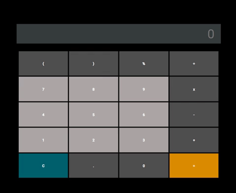
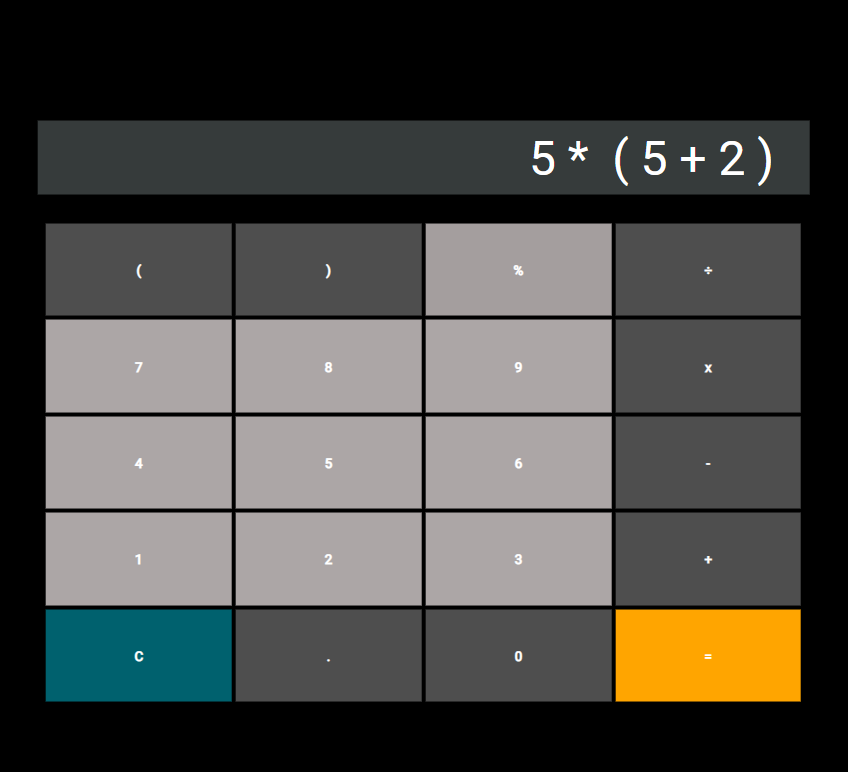

# Calculator App



## About:

An HTML Based Calculator App, that use javascript to calculate the value shown on the input.

```JavaScript
function getAnswer() {
    try {
        let oldScreenValue = screenValue;
        screenValue = eval(screenValue);
        screen.value = screenValue;
        savedAnswerScreen.value = oldScreenValue + " =";
        console.log(screen.value);
    } catch (e) {
        alert("ERROR");
        clear();
    }
}
```

My inspiration came from the  Microsoft Calculator on the Windows operating system, it is very similar in design but the functionality differs.

It has a max input length of 16 and has built in error responses to invalid equations.

## Installation:

1. Simply Install the 3  files (HTML, JS, CSS) and run the HTML!  


## Features:

### 1.) It has BODMAS built into it and can use brackets in a equation.



### Example: 


### 2.) It can use keypresses as well as button clicks.

```JavaScript
document.addEventListener("keydown", function (event) {
    if (screen.value.replace(/\s/g, '').length <= 16) {
        if (event.shiftKey == 57) {
            event.key = "(";
        } else if (event.shiftKey == 48) {
            event.key = ")";
        } else if (event.shiftKey == 53) {
            event.key = "%";
        }
        if (event.keyCode == 88) {
            screenValue += " * ";
            screen.value = screenValue;
        }
        if (event.key <= 9) {
            screenValue += event.key;
            screen.value = screenValue;
```
And many more not shown in the snippet of code!

### More features soon to come...
